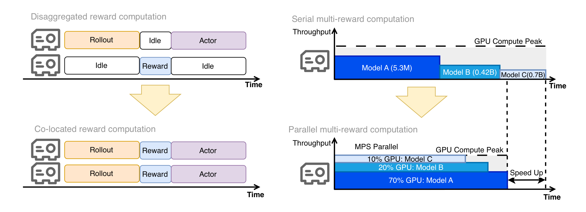

<p align="center">
  <picture>
    <source media="(prefers-color-scheme: dark)" srcset="https://raw.githubusercontent.com/FortPercent/TeleBoost/release-staging/documents/figures/logo_teleboost.jpeg">
    
  </picture>
</p>
<h3 align="center">
GRPO post-training for video diffusion models.
</h3>

<p align="center">
  <a href="https://arxiv.org/abs/2602.07595"></a>
  <a href="https://www.apache.org/licenses/LICENSE-2.0"></a>
  <a href="https://arxiv.org/abs/2511.18919"></a>
  <a href="https://arxiv.org/abs/2511.18719"></a>
</p>

TeleBoost (GRPO branch) is a **production RL training stack for Wan2.1 /
Wan2.2 text-to-video diffusion**, built as a recipe layer on top of
[`volcengine/verl`](https://github.com/volcengine/verl).

* 🎛️ **Five algorithms** — DanceGRPO (default), Flow-GRPO,
  GRPO-Guard, BGPO, VIPO; switch via `TELEBOOST_METHOD` + `ENABLE_*` flags
* 🎬 **CP for long sequences** — Wan Ulysses sequence parallel at
  sp ∈ {1, 2, 4, 8} unlocks higher frame count / resolution training
* 🧩 **MPS-parallel multi-reward** — N reward models compute *concurrently*
  on one GPU (wall-time ≈ max(model), not sum); 4 ship by default
  (aesthetic + RAFT + VideoCLIP + VideoPhy)
* 🆕 **Day-0 BGPO + VIPO** — both are TeleAI papers, implemented here on release

verl is consumed as a plain pip dependency, **not vendored**. Wan-specific
behavior that doesn't belong in upstream verl (model loader, FSDP wrap,
Ulysses SP patches, checkpoint compatibility) lives under
[`teleboost/`](teleboost/) and is applied at import time. Used internally
at TeleAI for Wan-family alignment.

<p align="center">
  
</p>

<p align="center"><sub><i>
4-reward joint mode. <b>Left</b>: disaggregated reward (separate ranks)
stalls on rollout-idle and reward-idle gaps. <b>Right</b>: co-located
reward + CUDA MPS — four reward models compute concurrently on the actor
GPUs; the joint forward finishes in roughly the time of the slowest model.
</i></sub></p>

---

## Headline matrix

| | Variant | Paper | What it does |
|---|---|---|---|
| 🟢 default | **DanceGRPO** | [arXiv 2505.07818](https://arxiv.org/abs/2505.07818) | GRPO for visual generation: per-prompt z-score advantage + σ_t = η constant SDE recast |
| | Flow-GRPO | [arXiv 2505.05470](https://arxiv.org/abs/2505.05470) | σ_t = η·√(t/(1−t)) form + sliding-window SDE |
| | GRPO-Guard | [arXiv 2510.22319](https://arxiv.org/abs/2510.22319) | RatioNorm (Eq. 8) + grad-reweight δ (Eq. 12) |
| 🔵 TeleAI | **BGPO** | [arXiv 2511.18919](https://arxiv.org/abs/2511.18919) | CRT reward rerange (Eq. 4) + RAS adaptive scaling (Eq. 2) |
| 🔵 TeleAI | **VIPO** | [arXiv 2511.18719](https://arxiv.org/abs/2511.18719) | DINOv2 PCA → per-pixel allocation map → dense advantage |

### Reward models

The four marked ✓ are combined when `TELEBOOST_METHOD=joint`; the rest
are usable as the sole reward via `REWARD_MODEL_PATH`.

| Reward model | Paper / repo | In `joint`? |
|---|---|---|
| HPSv2 | [arXiv 2306.09341](https://arxiv.org/abs/2306.09341) | — |
| LAION Aesthetic predictor | [repo](https://github.com/LAION-AI/aesthetic-predictor) | ✓ |
| RAFT (optical flow) | [arXiv 2003.12039](https://arxiv.org/abs/2003.12039) | ✓ |
| VideoCLIP-XL | [arXiv 2410.00741](https://arxiv.org/abs/2410.00741) | ✓ |
| VideoPhy | [arXiv 2406.03520](https://arxiv.org/abs/2406.03520) | ✓ |
| Qwen2.5-VL-7B / 32B | (vendored vLLM rollout) | — |
| DINOv2 (advantage shaper, not a reward) | [arXiv 2304.07193](https://arxiv.org/abs/2304.07193) | — (used by VIPO) |

### Supported configurations

| Dimension | Supported |
|---|---|
| Actor | Wan2.2-T2V-A14B (`wan_version=wan22`), Wan2.1-T2V-1.3B (`wan_version=wan21`) |
| Reward | HPSv2, Qwen2.5-VL-7B, 4-reward joint (aesthetic + RAFT + VideoCLIP + VideoPhy) |
| Algorithm | DanceGRPO (default), Flow-GRPO, GRPO-Guard, BGPO, VIPO |
| Rollout | Diffusion (actor), vLLM (Qwen reward) |
| Sequence parallel | sp ∈ {1, 2, 4, 8}; CP grad bit-exact at fp32 |
| Hardware | H800 / H100 80 GB |

---

## How it works

TeleBoost layers on top of verl in three places, applied at `import` time:

```
upstream verl  ──►  teleboost/patches/   ──►  recipe/teleboost/
(unchanged,         (Wan SP fwd, CP grad      (algorithm selector,
 v0.4.0 pinned)      reduce fix, save_compat,   reward registry,
                     timer/ProfilerConfig       run_teleboost.sh
                     backports)                 launcher)
```

1. **Patches** monkey-patch four narrow surfaces in verl (Wan Ulysses SP
   forward, CP grad reduce on modulation params, FrozenDict save
   compatibility, profiler/timer backports).
2. **Recipe** subclasses `RayPPOTrainer` and the FSDP worker, plugs in
   five paper-pinned algorithm modules and a reward registry, and routes
   them via env vars.
3. **Launcher** (`run_teleboost.sh`) is a single bash entry; every knob
   is an env var, every algorithm is one switch.

```python
# teleboost/__init__.py
from teleboost.patches import apply
apply()   # any process that imports teleboost (or recipe.teleboost.*) is patched
```

---

## Quickstart

```bash
# 1. Build the image (NGC PyTorch 24.08 + torch 2.6 + vllm 0.8.4 +
#    flash-attn 2.7.4.post1 + verl@v0.4.0 + reward stack)
docker build -f docker/Dockerfile.teleboost -t teleboost:latest .

# 2. Prep data (idempotent — accepts plain prompts.txt or existing JSON)
python data_preprocess/prepare_wan_data.py \
  --input prompts/mini_test.txt \
  --output_dir data/processed/ \
  --wan_model_path /path/to/Wan2.1-T2V-1.3B

# 3. Train — DanceGRPO defaults (Wan2.2-A14B, 8 GPUs, 480×832×49, 1000 steps)
TRAIN_FILE=data/processed/processed_wan_prompt.json \
TEST_FILE=data/processed/processed_wan_prompt.json \
WAN_MODEL_PATH=/path/to/Wan2.2-T2V-A14B \
WAN_VAE_PATH=/path/to/Wan2.2-T2V-A14B/Wan2.1_VAE.pth \
REWARD_MODEL_PATH=/path/to/HPS_v2.1_compressed.pt \
bash recipe/teleboost/run_teleboost.sh
```

For verl-prebuilt-image and bare-host paths, see [`INSTALL.md`](INSTALL.md)
and [`docs/install_from_scratch.md`](docs/install_from_scratch.md).
For region-mirrored Docker builds (Tsinghua), pass
`--build-arg APT_SOURCE=...  --build-arg PIP_INDEX=...`.

---

## Data schema

Every training row carries three fields:

| Field | Meaning |
|---|---|
| `caption` | Original prompt text — kept for logging and reward models that consume the raw string |
| `context_path` | umT5 embedding of the **positive** prompt |
| `context_null_path` | umT5 embedding of the shared **negative** prompt (CFG) |

The dataset loader fails fast if `context_null_path` is missing — without
it CFG collapses to `(1+scale)·cond` and reward variance vanishes
(`advantage=0`, `grad_norm=0`).

```json
{
  "caption": "a panda eating bamboo, cinematic lighting",
  "context_path": "data/processed/context_0.npy",
  "context_null_path": "data/processed/context_null.npy"
}
```

The prep script (`data_preprocess/prepare_wan_data.py`):

* accepts `.txt` (one prompt per line) **or** `.json` (`[{"caption": ...}, ...]`);
* loads the umT5 encoder lazily — only if something actually needs encoding;
* per row, skips T5 if `context_path` already points at an existing `.npy`;
* writes `processed_wan_prompt.json` + per-row `context_<i>.npy` +
  one shared `context_null.npy`;
* uses Wan's official Chinese negative-prompt template by default; override
  with `--negative_prompt "..."`.

---

## Model checkpoints

| Env var | Source | Expected target |
|---|---|---|
| `WAN_MODEL_PATH` | [`Wan-AI/Wan2.1-T2V-1.3B`](https://huggingface.co/Wan-AI/Wan2.1-T2V-1.3B) or [`Wan-AI/Wan2.2-T2V-A14B`](https://huggingface.co/Wan-AI/Wan2.2-T2V-A14B) | repo root (contains `Wan2.1_VAE.pth`, umT5 files, transformer weights) |
| `WAN_VAE_PATH` | same repo as above | `<WAN_MODEL_PATH>/Wan2.1_VAE.pth` |
| `REWARD_MODEL_PATH` | [`xswu/HPSv2`](https://huggingface.co/xswu/HPSv2) | `HPS_v2.1_compressed.pt` |
| `PIXEL_WEIGHT_MODEL_PATH` (VIPO) | [`facebook/dinov2-large`](https://huggingface.co/facebook/dinov2-large) | repo root (HF cache name also works) |
| `JOINT_AESTHETIC_CLIP_PATH` | [`openai/clip-vit-large-patch14`](https://huggingface.co/openai/clip-vit-large-patch14) | repo root |
| `JOINT_AESTHETIC_MODEL_PATH` | [LAION aesthetic predictor](https://github.com/LAION-AI/aesthetic-predictor/blob/main/sa_0_4_vit_l_14_linear.pth) | `sa_0_4_vit_l_14_linear.pth` |
| `JOINT_RAFT_MODEL_PATH` | [princeton-vl/RAFT](https://github.com/princeton-vl/RAFT) | `raft-things.pth` |
| `JOINT_VIDEOCLIP_MODEL_PATH` | [`alibaba-pai/VideoCLIP-XL`](https://huggingface.co/alibaba-pai/VideoCLIP-XL) | repo root |
| `JOINT_VIDEOPHY_MODEL_PATH` | [`videophysics/videocon_physics`](https://huggingface.co/videophysics/videocon_physics) | repo root |

The same `WAN_MODEL_PATH` works for both 1.3B and 14B prep — the prep
script only reads the umT5 files.

---

## Algorithm selector

| `TELEBOOST_METHOD` | Behavior | Extra env vars |
|---|---|---|
| `default` | DanceGRPO, nothing else | — |
| `bgpo` | DanceGRPO + Bayesian-Prior reranging + RAS adaptive scaling | rows must carry `prior` field (see below) |
| `vipo` | DanceGRPO + DINOv2 dense pixel-weight broadcast | `PIXEL_WEIGHT_MODEL_PATH=...` (default `facebook/dinov2-large`) |
| `joint` | 4-reward joint (aesthetic + RAFT + VideoCLIP + VideoPhy) | `JOINT_AESTHETIC_*`, `JOINT_RAFT_*`, `JOINT_VIDEOCLIP_*`, `JOINT_VIDEOPHY_*` |

#### `prior` field schema (BGPO only)

A scalar `float` ∈ [0, 1] — the per-prompt Bayesian prior expected reward.
Used by CRT (Eq. 4) to rerange the realized reward relative to the prior.
Reasonable default: compute once offline as the mean reward of K
base-model rollouts on that prompt and clip to `[0.05, 0.95]`.

```json
{
  "caption": "a panda eating bamboo",
  "context_path": "data/processed/context_0.npy",
  "context_null_path": "data/processed/context_null.npy",
  "prior": 0.42
}
```

### Common knobs

| Env var | Default | Notes |
|---|---|---|
| `N_GPUS_PER_NODE` | `8` | per-node world size |
| `SAMPLING_STEPS` | `16` | denoising steps in rollout |
| `TOTAL_TRAINING_STEPS` | `1000` | total optimizer steps |
| `VIDEO_HEIGHT`, `VIDEO_WIDTH`, `NUM_FRAMES` | `480`, `832`, `49` | resolution & frame count |
| `TRAIN_PROMPT_BSZ`, `N_RESP_PER_PROMPT` | `8`, `3` | batch shape (effective batch = bsz × n_resp) |
| `WAN_VERSION` | `wan22` | `wan21` for Wan2.1-1.3B |
| `VAL_BEFORE_TRAIN` | `False` | run validation before step 0 |
| `TELEBOOST_OUTPUT_DIR` | `./outputs` | parent for `checkpoints/` and `tensorboard/` |

### Orthogonal flags

These layer on top of `TELEBOOST_METHOD` and combine freely:

| Env var | Effect |
|---|---|
| `SP_SIZE=2` (or 4, 8) | Wan Ulysses sequence parallel; `world_size` must be divisible by `SP_SIZE` |
| `INIT_SAME_NOISE=False` | per-prompt responses get different starting noise — required for non-zero reward variance |
| `ENABLE_GRPOGUARD=True` | GRPO-Guard `ratio_norm` + `grad_reweight` |
| `ENABLE_FLOWGRPO=True` | Flow-GRPO SDE solver path; auto-bumps `SAMPLING_STEPS` to 4 if it was 1 |
| `ADV_ESTIMATOR=remax` | switch advantage estimator from default `grpo` to upstream verl's `remax` |

```bash
# sp=8 BGPO
TELEBOOST_METHOD=bgpo SP_SIZE=8 \
TRAIN_FILE=... TEST_FILE=... WAN_MODEL_PATH=... REWARD_MODEL_PATH=... \
bash recipe/teleboost/run_teleboost.sh
```

### Multi-node

Run the same command on every node — the launcher self-routes by
`NODE_RANK`. Master (rank 0) starts a Ray head and proceeds to training;
workers join the cluster and block on `ray start`.

| Env var | Required | Notes |
|---|---|---|
| `NNODES` | yes (>1) | total node count |
| `NODE_RANK` | yes | this node's rank; `0` = master |
| `MASTER_ADDR` | yes | hostname / IP of the master, reachable from every worker |
| `MASTER_PORT` | no | Ray head port; default `6379` |

```bash
# 4 nodes × 8 GPUs (32 GPUs total)
# master:
NNODES=4 NODE_RANK=0 MASTER_ADDR=node-0.example.com \
TRAIN_FILE=... TEST_FILE=... WAN_MODEL_PATH=... \
WAN_VAE_PATH=... REWARD_MODEL_PATH=... \
bash recipe/teleboost/run_teleboost.sh

# each worker (NODE_RANK=1, 2, 3):
NNODES=4 NODE_RANK=1 MASTER_ADDR=node-0.example.com ...same env... \
bash recipe/teleboost/run_teleboost.sh
```

`NNODES=1` (default) skips the Ray head/worker step entirely;
`main_teleboost` calls `ray.init()` itself for single-node runs.

---

## Multi-reward joint (`TELEBOOST_METHOD=joint`)

When `TELEBOOST_METHOD=joint`, four reward models co-exist on every actor
GPU and compute *concurrently*. Two architectural choices matter:

**1. Co-located reward + actor.** Reward workers share the actor GPUs
(`dp_fraction=1.0, rank_offset=0` for every model). The earlier
disaggregated layout (separate reward GPUs) was removed because
`_allgather_rewards` calls `dist.all_gather` on the default world process
group — any `dp_size != world_size` triggers a length-mismatch crash.
Co-location also eliminates the rollout-idle / reward-idle stalls in the
left half of the figure above.
See [`recipe/teleboost/config/teleboost_trainer.yaml`](recipe/teleboost/config/teleboost_trainer.yaml#L172).

**2. MPS-parallel multi-reward.** Four reward forwards run *serially* on
one GPU would block the actor on the wall-clock sum of all four model
forwards. CUDA MPS lets each reward model occupy a fixed thread
percentage of the same GPU; the four compute concurrently, and the joint
forward finishes in roughly `max(model)`, not `Σ(model)`.

| Model | ≈ params | `mps_percentage` |
|---|---|---|
| `aesthetic` (LAION ViT-L/14 + linear head) | 5.3 M | 20 |
| `raft` (RAFT optical flow) | 5.3 M | 30 |
| `videoclip` (VideoCLIP-XL) | 0.42 B | 25 |
| `videophy` (videocon_physics) | 7 B | 25 |

Constraint: percentages should sum to ≤ 100. The loader does not enforce
this, but CUDA MPS itself caps the total at 100% effective. Sums < 100
leave the remainder unallocated (the kernel launcher uses whatever
threads are free, with no guarantee).

```bash
# tune one model's share (rebalance the others so the sum stays ≤100)
bash recipe/teleboost/run_teleboost.sh \
  reward_model.joint.mps.model_percentages.videophy=40 \
  reward_model.joint.mps.model_percentages.videoclip=15

# disable MPS — falls back to within-GPU serial
bash recipe/teleboost/run_teleboost.sh \
  reward_model.joint.mps.enabled=false
```

Aggregation across rewards is configurable via
`reward_model.joint.aggregation` (default `weighted_sum`); per-model
weights live under `reward_model.joint.models.<name>.weight`.

---

## Hard requirements

- **GPU**: H800 / H100 80 GB; SM 8.0+ in principle, but flash-attn 2.7.4
  wheel is built for SM 8.0 / 9.0.
- **CUDA**: cu12 stack (NGC PyTorch 24.08 base); driver compatible with
  cu12.
- **Python**: 3.10 (NGC base).
- **Pinned**: `verl@v0.4.0`, `transformers<5`, `vllm==0.8.4`,
  `flash-attn==2.7.4.post1`, `deepspeed` not used (verl's FSDP path).

The [`docker/Dockerfile.teleboost`](docker/Dockerfile.teleboost) bakes
everything ABI-aligned (incl. the hpsv2 BPE-vocab fix and a tkinter shim
that hpsv2 imports at module load). Do not casually upgrade torch /
transformer_engine / flash-attn / verl inside the image — see
[`requirements-pinned.txt`](requirements-pinned.txt) for the rationale.

---

## Repository layout

```
recipe/teleboost/                     Recipe (entry + workers + scripts)
├── main_teleboost.py                     Hydra entry; spawns Ray workers
├── teleboost_ray_trainer.py              RayPPOTrainer subclass
├── dp_actor.py                           DataParallelPPOActor subclass
├── teleboost_fsdp_worker.py              7 reward workers + DiffusionActor… subclass
├── unified_reward_worker.py              plugin-style reward worker
├── reward_models/                        registry + 5 plugins + composite + dynamic_joint
├── algorithms/                           paper-pinned algorithm modules
├── config/teleboost_trainer.yaml         Hydra config
└── run_teleboost.sh                      unified env-driven launcher

teleboost/                            TeleBoost-only extensions
├── models/transformers/wan.py            Wan Ulysses SP forward + helpers
├── models/transformers/wan22.py          Wan2.2 dual-model wrapper
├── workers/rollout/diffusion_rollout.py  diffusion rollout (replaces vllm rollout)
├── workers/sharding_manager/diffusion.py FSDP sharding manager
├── utils/diffusion_ulysses.py            SP > 1 split/gather autograd Functions
└── patches/                              runtime monkey-patches over verl
    ├── ulysses_cp_fix.py                 CP grad reduce fix (modulation params)
    ├── wan_ulysses.py                    inject Wan SP helpers into verl.utils.ulysses
    ├── wan_save_compat.py                FrozenDict.save_pretrained no-op
    └── debug_extras.py                   marked_timer / simple_timer / ProfilerConfig backports

wan/                                  Wan2.1 / Wan2.2 backbone (vendored, lightly patched)
data_preprocess/prepare_wan_data.py   umT5 prompt-embedding prep (idempotent)
models/videoalign/                    Qwen2VL video-alignment reward trainer (standalone)
prompts/                              prompt lists for preprocess
docs/                                 docs + figures
tests/special_distributed/            distributed regression tests (CP grad reduce)
```

`teleboost/__init__.py` runs `teleboost.patches.apply()` at import time,
so any process that does `import teleboost` (or imports anything under
`recipe.teleboost.*`, which imports teleboost) ends up with the patches
applied automatically.

---

## Documentation

| File | Topic |
|---|---|
| [`INSTALL.md`](INSTALL.md) | Fast install on a verl-ready Docker image |
| [`docs/install_from_scratch.md`](docs/install_from_scratch.md) | Bare-host install + every gotcha |
| [`requirements-pinned.txt`](requirements-pinned.txt) | Full pin file (every transitive dep) |
| [`CONTRIBUTING.md`](CONTRIBUTING.md) | How to send a PR, run tests, file an issue |

---

## Roadmap

* **Day-0 support for new TeleAI algorithms** — keep the BGPO / VIPO
  cadence: new TeleAI alignment papers land in this codebase on release
* **BAGEL** — unified multi-modal understanding + generation as an actor
* **World models** — extend the actor side beyond pure T2V video diffusion

Issues / PRs welcome.

---

## Citation

If TeleBoost is useful for your work, please cite the framework paper:

```bibtex
@article{teleboost2026,
  title   = {TeleBoost: A Systematic Alignment Framework for High-Fidelity,
             Controllable, and Robust Video Generation},
  author  = {Liang, Yuanzhi and Wu, Xuan'er and Liu, Yirui and Fang, Yijie
             and Fan, Yizhen and Hao, Ke and Li, Rui and Liu, Ruiying
             and Ni, Ziqi and Yu, Peng and Wang, Yanbo and Huang, Haibin
             and Weng, Qizhen and Zhang, Chi and Li, Xuelong},
  journal = {arXiv preprint arXiv:2602.07595},
  year    = {2026},
  url     = {https://arxiv.org/abs/2602.07595}
}
```

The two TeleAI algorithms shipped day-0 in this codebase:

```bibtex
@article{liu2025bgpo,
  title   = {Learning What to Trust: Bayesian Prior-Guided Optimization
             for Visual Generation},
  author  = {Liu, Ruiying and Liang, Yuanzhi and Huang, Haibin
             and Yu, Tianshu and Zhang, Chi},
  journal = {arXiv preprint arXiv:2511.18919},
  year    = {2025},
  url     = {https://arxiv.org/abs/2511.18919}
}

@article{ni2025vipo,
  title   = {Seeing What Matters: Visual Preference Policy Optimization
             for Visual Generation},
  author  = {Ni, Ziqi and Liang, Yuanzhi and Li, Rui and Zhou, Yi
             and Huang, Haibin and Zhang, Chi and Li, Xuelong},
  journal = {arXiv preprint arXiv:2511.18719},
  year    = {2025},
  url     = {https://arxiv.org/abs/2511.18719}
}
```

For the upstream papers TeleBoost builds on (DanceGRPO, Flow-GRPO,
GRPO-Guard, GRPO), see [`CITATION.cff`](CITATION.cff) — ready for
`cffconvert` / GitHub's "Cite this repository" widget.

---

## License & acknowledgments

Apache 2.0 (see [`LICENSE`](LICENSE) and [`Notice.txt`](Notice.txt)).

This codebase stands on the shoulders of several open-source projects.
We thank the authors of all of the following.

**Framework**

* [**volcengine/verl**](https://github.com/volcengine/verl) (Apache 2.0,
  Bytedance Seed) — the PPO / GRPO training engine. We pin
  `verl@v0.4.0` and consume it as a pip dependency rather than vendoring;
  recipe-level extensions live under
  [`recipe/teleboost/`](recipe/teleboost/) and
  [`teleboost/`](teleboost/).

**Algorithms**

The algorithm modules under
[`recipe/teleboost/algorithms/`](recipe/teleboost/algorithms/) are
paper-faithful translations of:

* GRPO ([DeepSeekMath, arXiv 2402.03300](https://arxiv.org/abs/2402.03300)) — base objective; not a standalone training mode here
* DanceGRPO ([arXiv 2505.07818](https://arxiv.org/abs/2505.07818))
* Flow-GRPO ([arXiv 2505.05470](https://arxiv.org/abs/2505.05470))
* GRPO-Guard ([arXiv 2510.22319](https://arxiv.org/abs/2510.22319))
* BGPO ([arXiv 2511.18919](https://arxiv.org/abs/2511.18919))
* VIPO ([arXiv 2511.18719](https://arxiv.org/abs/2511.18719))

See each module's docstring for the equation pin.

**Models — actor backbones**

* [**Wan-Video/Wan2.1**](https://github.com/Wan-Video/Wan2.1) and
  [**Wan-Video/Wan2.2**](https://github.com/Wan-Video/Wan2.2) —
  text-to-video diffusion actor. The `wan/` directory bundles their
  model code; the FSDP / Ulysses-SP wrap and CP-grad-reduce fix in
  [`teleboost/patches/`](teleboost/patches/) are our additions.

**Reward models**

* [**tgxs002/HPSv2**](https://github.com/tgxs002/HPSv2)
  ([arXiv 2306.09341](https://arxiv.org/abs/2306.09341))
* [**alibaba-pai/VideoCLIP-XL**](https://huggingface.co/alibaba-pai/VideoCLIP-XL)
  ([arXiv 2410.00741](https://arxiv.org/abs/2410.00741))
* [**LAION-AI/aesthetic-predictor**](https://github.com/LAION-AI/aesthetic-predictor)
* [**princeton-vl/RAFT**](https://github.com/princeton-vl/RAFT)
  ([arXiv 2003.12039](https://arxiv.org/abs/2003.12039))
* [**videophysics/videocon_physics**](https://huggingface.co/videophysics/videocon_physics)
  ([arXiv 2406.03520](https://arxiv.org/abs/2406.03520))
* [**facebook/dinov2**](https://github.com/facebookresearch/dinov2)
  ([arXiv 2304.07193](https://arxiv.org/abs/2304.07193)) — used by VIPO
  for per-pixel allocation maps.

**Compute & systems**

* [**vllm-project/vllm**](https://github.com/vllm-project/vllm) — Qwen
  reward worker rollout.
* [**Dao-AILab/flash-attention**](https://github.com/Dao-AILab/flash-attention)
  — flash-attn 2.7.4.post1 used in actor + reward rollouts.
* [**flashinfer-ai/flashinfer**](https://github.com/flashinfer-ai/flashinfer)
  — vLLM kernel backend.
