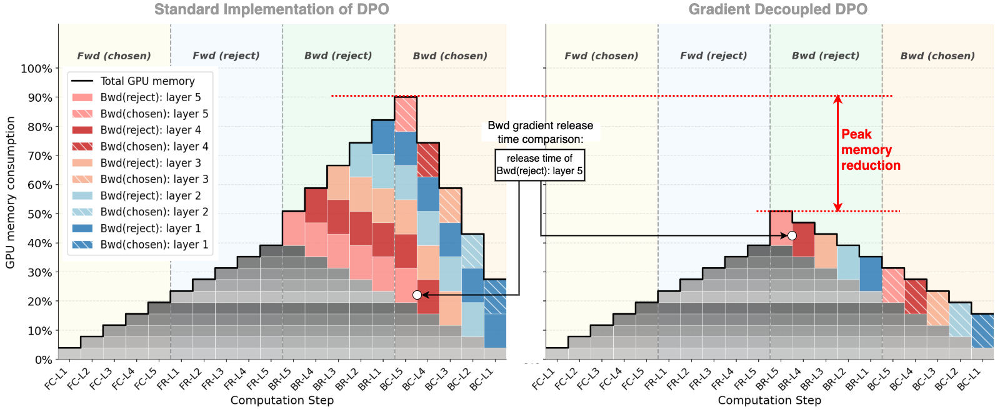

<p align="center">
  <picture>
    <source media="(prefers-color-scheme: dark)" srcset="documents/figures/logo_teleboost.jpeg">
    
  </picture>
</p>
<h3 align="center">
Memory-efficient DPO post-training for video diffusion models.
</h3>

<p align="center">
  <a href="https://arxiv.org/abs/2602.07595"></a>
  <a href="https://www.apache.org/licenses/LICENSE-2.0"></a>
  <a href="https://arxiv.org/abs/2511.18919"></a>
  <a href="https://arxiv.org/abs/2511.18719"></a>
</p>

This is a **Post-training framework for video diffusion models**,
featuring **Gradient Decoupled DPO** — a per-branch backward +
immediate reduce-scatter pattern that on Wan 14B 40-layer DPO at
32×H800:

* **Cuts peak GPU memory by ~40%** on identical workload (69.27 GB → 41.39 GB at 25 f / 480p)
* **Extends supported context length by ~15×** — Standard DPO max-fits at 25 f / 480p (~11k visual tokens), Decoupled max-fits at 77 f / 1080p (~163k visual tokens) on the same hardware
* **Lets the production default (49 f / 480p) actually run** — Standard DPO OOMs, Decoupled finishes at 42.90 GB

It is mathematically equivalent to the single-backward formulation
(verified element-wise on 14.78 B gradient elements at 32-GPU
production shape).

Built on [Tele-AI/TeleTron](https://github.com/Tele-AI/TeleTron) — TeleAI's
long-context multi-modal training framework — together with
[megatron-core 0.16.1](https://github.com/NVIDIA/Megatron-LM/tree/core_v0.16.1)
and DeepSpeed ZeRO-2. Production in TeleAI internally for Wan-family training.

<p align="center">
  
</p>

<p align="center"><sub><i>
Wan 14B I2V DPO, 40 layers, bf16 + ZeRO-2 + recompute=full + flash-attn 3, 32×H800, n_iters=2 strict.
<b>Left</b>: same workload, ~40% memory cut. <b>Middle</b>: production default, standard OOMs and Decoupled fits. <b>Right</b>: Decoupled scales to ~15× longer context than standard.
</i></sub></p>

---

## Headline numbers — Wan 14B 40-layer DPO at 32×H800 (n_iters=2 strict)

| Setting | Visual tokens | Standard DPO | **Gradient Decoupled DPO** | Δ |
|---|---|---|---|---|
| 25 f / 480p — *standard's max-fit* | ~11 k | 69.27 GB ✓ | **41.39 GB ✓** | **−40.3%** |
| **49 f / 480p — *production default*** | **~20 k** | **❌ OOM** | **42.90 GB ✓** | **qualitative** ✅ |
| 77 f / 1080p — *decoupled's max-fit* | ~163 k | ❌ OOM | **69.32 GB ✓** | **qualitative · ~15× tokens** ✅ |

Three concrete wins on the same 32-GPU H800 hardware:
1. **−40% peak memory on identical workload** (25 f / 480p ~11 k tokens)
2. **Production default actually runs** (49 f / 480p ~20 k tokens crashes standard DPO with OOM)
3. **~15× longer supported context length** (~11 k → ~163 k visual tokens)

### Mathematical equivalence (verified element-wise)

The split pattern is mathematically identical to single-backward of the
summed loss: `my_slice(g_chosen) + my_slice(g_rejected) = my_slice(∇(loss_chosen + loss_rejected))`
by chain rule + reduce-scatter linearity. We verified this element-wise
on Wan 14B 36-layer at 32-GPU production shape: **14.78 billion gradient
elements compared, max\|Δgrad\| = 2.44e-4** — well below the bf16 ULP
threshold of 1e-3. The non-bit-identical fraction is float-rounding-order
in the bucket reduce-scatter accumulator, irrelevant to training stability.

## How it works

<p align="center">
  
</p>

<p align="center"><sub><i>
Per-step GPU memory across the DPO forward + backward timeline.
<b>Left</b>: Standard DPO holds both branches' full-shape gradients
simultaneously during the reverse pass — peak stacks layer-by-layer.
<b>Right</b>: Decoupled DPO reduce-scatters each branch's gradient as
soon as its backward finishes, freeing the full-shape tensor before
the next branch starts. The marked "peak memory reduction" is the
difference both panels share their y-axis on.
</i></sub></p>

In code:

```python
# Standard DPO: both branches' grads alive together at peak
(coeff * loss_chosen - coeff * loss_rejected).backward()
optimizer.epilogue()

# Gradient Decoupled DPO: per-branch backward, immediate reduce-scatter
for t in [-coeff * loss_rejected, coeff * loss_chosen]:
    optimizer.backward(t)
    optimizer.overlapping_partition_gradients_reduce_epilogue()
    # → my-shard 1/N of t's gradient written to averaged_gradients
    # → full-shape grad tensor freed before next backward starts
```

---

## Quickstart

See [QUICKSTART.md](QUICKSTART.md) for the full walkthrough.

```bash
# 1. Build the image (Hopper / SM 9.0; ~80 min on a clean cache including
#    flash-attn 2 + flash-attn 3 source build)
docker build -t teleboost:mc0.16.1 .

# 2. Run on 8 H100 / H200 / H800
docker run -it --gpus all --shm-size 512G \
    -v $(pwd):/workspace/Teletron \
    -v /path/to/your/data:/data \
    teleboost:mc0.16.1

# 3. Smoke test inside the container
cd /workspace/Teletron
torchrun --nproc_per_node=8 examples/wan/pretrain_wan2_2.py \
    --dataset-type FakeDataset --bf16 --use-zero2 ...
# (full args in QUICKSTART.md)

# 4. Real DPO training
export MEGATRON_LM_DIR=/path/to/Megatron-LM
export TELEAI_DATA_TOOL_DIR=/path/to/teleai_data_tool   # for production data
bash examples/teleai/train_dpo.sh
```

For users without `teleai_data_tool` (the internal data-infrastructure
package), subclass `teletron.datasets.DPODatasetBase` and register your
own dataset — see QUICKSTART for the 30-line template.

---

## Architecture

```
┌─────────────────────────────────────────────────────────────┐
│  examples/teleai/train_dpo.sh                               │
│  └─→ examples/teleai/pretrain_dpo_i2v.py                    │
│      └─→ teletron.train.Trainer                             │
│           ├─ ParallelWanModel (40-layer DiT)                │
│           ├─ DistributedVAE (text + image + video encoder)  │
│           └─ DeepSpeedZeroOptimizer (ZeRO-2 partition_grads)│
│                └─ deepspeed_backward_step (split DPO path)  │
└─────────────────────────────────────────────────────────────┘
       │
       ├─ CP=8  : context parallelism via Ulysses (head-dim sharding)
       ├─ ZeRO-2: optimizer state partitioned across DP_with_CP group
       ├─ recompute=full+block : every block input checkpointed
       └─ bf16 : mixed precision with fp32 master weights
```

---

## Parallelism configuration

| Flag | Description |
|---|---|
| `--context-parallel-size` (`CP`) | sequence parallelism within node; head-dim sharded (Ulysses) |
| `--tensor-model-parallel-size` (`TP`) | tensor-parallel; weight-dim sharded |
| `--use-zero2` | enable DeepSpeedZeroOptimizer + Gradient Decoupled DPO path |
| `--distributed-vae` | run encoder on dedicated ranks, freeing DiT ranks |
| `--distributed-vae-world-size` (`N_VAE`) | encoder rank count |
| `--consumer-models-num` (`N_MOE`) | DiT model copies (1 = no MoE) |

Constraint: `(TP × CP)` must divide `num_attention_heads`. For Wan 14B
(40 heads), valid CP×TP combos are 1, 2, 4, 5, 8, 10, 20, 40.

---

## Supported models

| Model | Params | dim | heads | layers |
|---|---|---|---|---|
| Wan2.1 / Wan2.2 (T2V/I2V) | 14B | 5120 | 40 | 40 |
| Wan2.1 1.3B | 1.3B | 1536 | 12 | 30 |

Production focus is **Wan 14B I2V DPO** (`examples/teleai/`); other
variants live under `examples/wan/`.

---

## Common features

- **EMA** (`--with-ema --ema-decay 0.9999`): EMA weights sharded across
  DP for low memory overhead.
- **Checkpoint resume** (`--save / --load --save-interval`): full
  optim-state + RNG-state included; `--data-parallel-random-init`
  recommended for stable DPO training (per-DP-rank timestep RNG).
- **`torch.compile` for VAE** (`torch_compile=True` in encoder config):
  20-40% encoder speed-up.
- **flash-attn 2** auto-used; **flash-attn 3** on Hopper auto-detected
  via `transformer_engine`.

---

## Hard requirements

- **GPU**: SM 9.0 (H100 / H200 / H800) recommended; SM 8.0+ works with
  `--build-arg BUILD_FA3=0`.
- **CUDA**: 13.0 (NGC 25.09); driver compatible with cu13 stack.
- **Python**: 3.12.

The [Dockerfile](Dockerfile) bakes everything ABI-aligned. Do not
upgrade torch / transformer_engine / apex / deepspeed inside the
image — see comments at the top of `Dockerfile` and `requirements.txt`
for the rationale (deepspeed 0.17.6+ in particular breaks the
multi-call epilogue that Gradient Decoupled DPO depends on).

---

## Repository layout

```
TeleBoost/
├── README.md           ← you are here
├── QUICKSTART.md       ← full setup + first-run guide
├── Dockerfile          ← reproducible NGC 25.09 + flash-attn 2/3
├── requirements.txt    ← pinned Python deps; deepspeed==0.17.5
├── examples/
│   ├── teleai/         ← Wan 14B DPO production entry
│   │   ├── train_dpo.sh
│   │   ├── pretrain_dpo_i2v.py
│   │   └── config/wan_dpo.py
│   └── wan/            ← Wan T2V/I2V non-DPO entries
│       ├── pretrain_wan.py
│       ├── pretrain_wan2_2.py
│       └── ...
├── teletron/
│   ├── train/
│   │   ├── utils.py            ← deepspeed_backward_step (split path)
│   │   ├── lr_scheduler.py     ← optimizer wiring
│   │   └── trainer.py
│   ├── models/wan/             ← ParallelWanModel
│   ├── core/context_parallel/  ← CP all-to-all
│   └── datasets/
│       ├── dpo_base.py         ← DPODatasetBase  ← OSS users subclass
│       ├── fake_dataset.py     ← FakeDataset for smoke tests
│       └── build.py            ← lazy registry
└── tests/
```

---

## Citation

```bibtex
@article{teleboost2026,
  title   = {TeleBoost: A Systematic Alignment Framework for High-Fidelity,
             Controllable, and Robust Video Generation},
  author  = {Liang, Yuanzhi and Wu, Xuan'er and Liu, Yirui and Fang, Yijie
             and Fan, Yizhen and Hao, Ke and Li, Rui and Liu, Ruiying
             and Ni, Ziqi and Yu, Peng and Wang, Yanbo and Huang, Haibin
             and Weng, Qizhen and Zhang, Chi and Li, Xuelong},
  journal = {arXiv preprint arXiv:2602.07595},
  year    = {2026},
  url     = {https://arxiv.org/abs/2602.07595},
}
```
