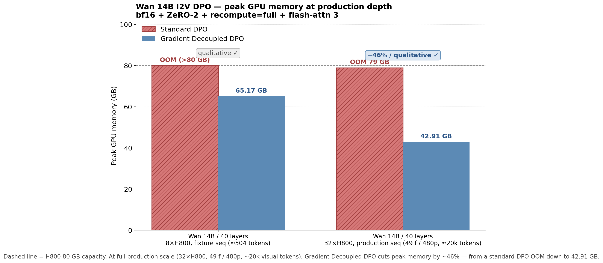

<p align="center">
  <picture>
    <source media="(prefers-color-scheme: dark)" srcset="documents/figures/logo_teleboost.jpeg">
    
  </picture>
</p>
<h3 align="center">
面向视频扩散模型的显存高效 DPO 后训练框架
</h3>

<p align="center">
  <a href="https://tele-ai.github.io/TeleBoost/"></a>
  <a href="https://arxiv.org/abs/2602.07595"></a>
  <a href="https://www.apache.org/licenses/LICENSE-2.0"></a>
</p>

[English](README.md) | 中文

TeleBoost 是一个**面向视频扩散模型的后训练框架**。
其核心特性 **Gradient Decoupled DPO** 采用「逐分支反向 + 即时
reduce-scatter」的范式，**适用于 TeleTron 支持的任意扩散模型**
（Wan 2.1 / 2.2、T2V / I2V 等）。在 32×H800 上训练 Wan 14B DPO 的
实测结果：

* 🔥 **相同负载下峰值显存降低约 40%**（69.27 → 41.39 GB）
* 📐 **可承载的上下文长度扩展约 15 倍**（~11k → ~163k 视觉 token）

该方案与单次反向的实现**数学等价**（在 32 卡生产形状下、对
14.78 B 个梯度元素逐元素验证一致）。

基于 [TeleTron](https://github.com/Tele-AI/TeleTron) ——
TeleAI 的长上下文多模态训练框架 —— 升级至
[megatron-core 0.16.1](https://github.com/NVIDIA/Megatron-LM/tree/core_v0.16.1)，
并加入 Gradient Decoupled DPO。已在 TeleAI 内部用于扩散模型的生产训练。

<p align="center">
  
</p>

<p align="center"><sub><i>
Wan 14B DPO，bf16 + ZeRO-2 + recompute=full + flash-attn 3，32×H800。
<b>左</b>：相同负载下显存削减约 40%。<b>中</b>：生产默认配置下，
标准方案 OOM，而 Decoupled 顺利完成。<b>右</b>：Decoupled 可扩展到
约 15 倍于标准方案的上下文长度。
</i></sub></p>

---

## 关键指标 —— Wan 14B DPO，32×H800

| 配置 | 视觉 token | 标准 DPO | **Gradient Decoupled DPO** | Δ |
|---|---|---|---|---|
| 25 f / 480p — *标准方案极限* | ~11 k | 69.27 GB ✓ | **41.39 GB ✓** | **−40.3%** |
| 49 f / 480p — *生产默认* | ~20 k | ❌ OOM | **42.90 GB ✓** | 通过 ✓ |
| 77 f / 1080p — *Decoupled 极限* | ~163 k | ❌ OOM | **69.32 GB ✓** | **token 数约 15×** |

在同一套 32 卡 H800 硬件上获得两项实质收益：
1. **相同负载下峰值显存降低 40%**（25 f / 480p，~11 k tokens）
2. **支持的上下文长度扩展约 15 倍**（~11 k → ~163 k 视觉 token）

### 数学等价性

按链式法则与 reduce-scatter 的线性性，分支拆分形式与对求和损失做
单次反向完全一致：
`my_slice(g_chosen) + my_slice(g_rejected) = my_slice(∇(loss_chosen + loss_rejected))`。

## 工作原理

<p align="center">
  
</p>

<p align="center"><sub><i>
DPO 前向 + 反向时间轴上的逐步 GPU 显存占用。
<b>左</b>：标准 DPO 在整个反向过程中同时持有 chosen 与 rejected
两路分支的全形状梯度，逐层堆叠形成高峰值。
<b>右</b>：Decoupled DPO 在每个分支反向完成后立即将其梯度
reduce-scatter 到本 rank 的 1/N 分片，在下一次反向开始前释放全形状
张量。图中标注的 "peak memory reduction" 即为两图共享 y 轴下的差值。
</i></sub></p>

代码示意：

```python
# 标准 DPO：峰值时两分支的梯度同时驻留显存
(coeff * loss_chosen - coeff * loss_rejected).backward()
optimizer.epilogue()

# Gradient Decoupled DPO：逐分支反向 + 即时 reduce-scatter
for t in [-coeff * loss_rejected, coeff * loss_chosen]:
    optimizer.backward(t)
    optimizer.overlapping_partition_gradients_reduce_epilogue()
    # → 将本 rank 1/N 的梯度分片写入 averaged_gradients
    # → 在下一次反向开始前释放全形状梯度张量
```

---

## 快速开始

完整流程见 [QUICKSTART.md](QUICKSTART.md)。

```bash
# 1. 构建镜像（Hopper / SM 9.0；干净缓存下约 80 分钟，
#    包含 flash-attn 2 + flash-attn 3 源码编译）
docker build -t teleboost:mc0.16.1 .

# 2. 在 8 卡 H100 / H200 / H800 上运行
docker run -it --gpus all --shm-size 512G \
    -v $(pwd):/workspace/TeleBoost \
    -v /path/to/your/data:/data \
    teleboost:mc0.16.1

# 3. 容器内冒烟测试
cd /workspace/TeleBoost
torchrun --nproc_per_node=8 examples/wan/pretrain_wan2_2.py \
    --dataset-type FakeDataset --bf16 --use-zero2 ...
# （完整参数见 QUICKSTART.md）

# 4. 真实 DPO 训练
export MEGATRON_LM_DIR=/path/to/Megatron-LM
export TELEAI_DATA_TOOL_DIR=/path/to/teleai_data_tool   # 生产数据所需
bash examples/teleai/train_dpo.sh
```

如果没有 `teleai_data_tool`（内部数据基础设施包），可继承
`teleboost.datasets.DPODatasetBase` 并注册自定义数据集 ——
QUICKSTART 中给出了一个 30 行的模板。

---

## 并行配置

| 参数 | 说明 |
|---|---|
| `--context-parallel-size` (`CP`) | 节点内序列并行；按 head 维切分（Ulysses） |
| `--tensor-model-parallel-size` (`TP`) | 张量并行；按权重维切分 |
| `--use-zero2` | 启用 DeepSpeedZeroOptimizer + Gradient Decoupled DPO 路径 |
| `--distributed-vae` | 在专用 rank 上运行编码器，释放 DiT rank |
| `--distributed-vae-world-size` (`N_VAE`) | 编码器 rank 数 |
| `--consumer-models-num` (`N_MOE`) | DiT 模型副本数（1 = 不启用 MoE） |

约束：`(TP × CP)` 必须能整除 `num_attention_heads`。对于 Wan 14B
（40 个 head），合法的 CP×TP 组合为 1、2、4、5、8、10、20、40。

---

## 通用特性

- **EMA**（`--with-ema --ema-decay 0.9999`）：EMA 权重在 DP 维分片，
  显存开销很低。
- **断点续训**（`--save / --load --save-interval`）：包含完整的优化器
  状态与 RNG 状态；建议为稳定的 DPO 训练加上
  `--data-parallel-random-init`（实现各 DP rank 独立的 timestep 随机数）。
- **VAE 的 `torch.compile`**（编码器配置中 `torch_compile=True`）：
  编码器加速 20-40%。
- **flash-attn 2** 自动启用；在 Hopper 架构上通过
  `transformer_engine` 自动检测并启用 **flash-attn 3**。

---

## 硬件要求

- **GPU**：推荐 SM 9.0（H100 / H200 / H800）；SM 8.0+ 可通过
  `--build-arg BUILD_FA3=0` 使用。
- **CUDA**：13.0（NGC 25.09）；驱动需兼容 cu13 工具链。
- **Python**：3.12。

[Dockerfile](Dockerfile) 中已固定全部 ABI 对齐版本。请勿在镜像内
升级 torch / transformer_engine / apex / deepspeed —— 原因详见
`Dockerfile` 与 `requirements.txt` 顶部注释（特别是 deepspeed
0.17.6+ 会破坏 Gradient Decoupled DPO 所依赖的多次 epilogue 调用）。

---

## 仓库结构

```
TeleBoost/
├── README.md           ← 英文版
├── README_ZN.md        ← 中文版（当前文件）
├── QUICKSTART.md       ← 完整安装与首次运行指南
├── Dockerfile          ← 可复现的 NGC 25.09 + flash-attn 2/3
├── requirements.txt    ← 锁定的 Python 依赖；deepspeed==0.17.5
├── examples/
│   ├── teleai/         ← Wan 14B DPO 生产入口
│   │   ├── train_dpo.sh
│   │   ├── pretrain_dpo_i2v.py
│   │   └── config/wan_dpo.py
│   └── wan/            ← Wan T2V/I2V 非 DPO 入口
│       ├── pretrain_wan.py
│       ├── pretrain_wan2_2.py
│       └── ...
├── teleboost/
│   ├── train/
│   │   ├── utils.py            ← deepspeed_backward_step（拆分路径）
│   │   ├── lr_scheduler.py     ← 优化器装配
│   │   └── trainer.py
│   ├── models/wan/             ← ParallelWanModel
│   ├── core/context_parallel/  ← CP all-to-all
│   └── datasets/
│       ├── dpo_base.py         ← DPODatasetBase  ← OSS 用户继承此类
│       ├── fake_dataset.py     ← 用于冒烟测试的 FakeDataset
│       └── build.py            ← 懒加载注册表
└── tests/
```

---

## 引用

```bibtex
@article{teleboost2026,
  title   = {TeleBoost: A Systematic Alignment Framework for High-Fidelity,
             Controllable, and Robust Video Generation},
  author  = {Liang, Yuanzhi and Wu, Xuan'er and Liu, Yirui and Fang, Yijie
             and Fan, Yizhen and Hao, Ke and Li, Rui and Liu, Ruiying
             and Ni, Ziqi and Yu, Peng and Wang, Yanbo and Huang, Haibin
             and Weng, Qizhen and Zhang, Chi and Li, Xuelong},
  journal = {arXiv preprint arXiv:2602.07595},
  year    = {2026},
  url     = {https://arxiv.org/abs/2602.07595},
}
```
