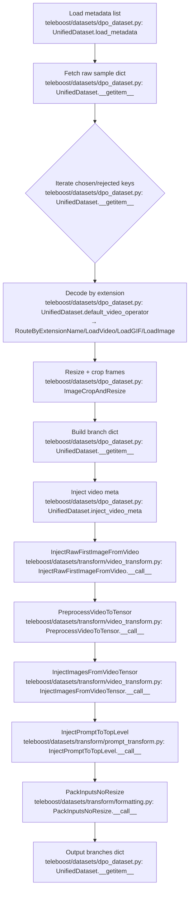

```mermaid
flowchart TD
  A[Load metadata list\nteleboost/datasets/dpo_dataset.py: UnifiedDataset.load_metadata] --> 
  B[Fetch raw sample dict\nteleboost/datasets/dpo_dataset.py: UnifiedDataset.__getitem__] --> 
  C{Iterate chosen/rejected keys\nteleboost/datasets/dpo_dataset.py: UnifiedDataset.__getitem__}

  C --> D[Decode by extension\nteleboost/datasets/dpo_dataset.py: UnifiedDataset.default_video_operator\n→ RouteByExtensionName/LoadVideo/LoadGIF/LoadImage]
  D --> E[Resize + crop frames\nteleboost/datasets/dpo_dataset.py: ImageCropAndResize]
  E --> F[Build branch dict\nteleboost/datasets/dpo_dataset.py: UnifiedDataset.__getitem__]
  F --> G[Inject video meta\nteleboost/datasets/dpo_dataset.py: UnifiedDataset.inject_video_meta]

  G --> H[InjectRawFirstImageFromVideo\nteleboost/datasets/transform/video_transform.py: InjectRawFirstImageFromVideo.__call__]
  H --> I[PreprocessVideoToTensor\nteleboost/datasets/transform/video_transform.py: PreprocessVideoToTensor.__call__]
  I --> J[InjectImagesFromVideoTensor\nteleboost/datasets/transform/video_transform.py: InjectImagesFromVideoTensor.__call__]
  J --> K[InjectPromptToTopLevel\nteleboost/datasets/transform/prompt_transform.py: InjectPromptToTopLevel.__call__]
  K --> L[PackInputsNoResize\nteleboost/datasets/transform/formatting.py: PackInputsNoResize.__call__]
  L --> M[Output branches dict\nteleboost/datasets/dpo_dataset.py: UnifiedDataset.__getitem__]

```